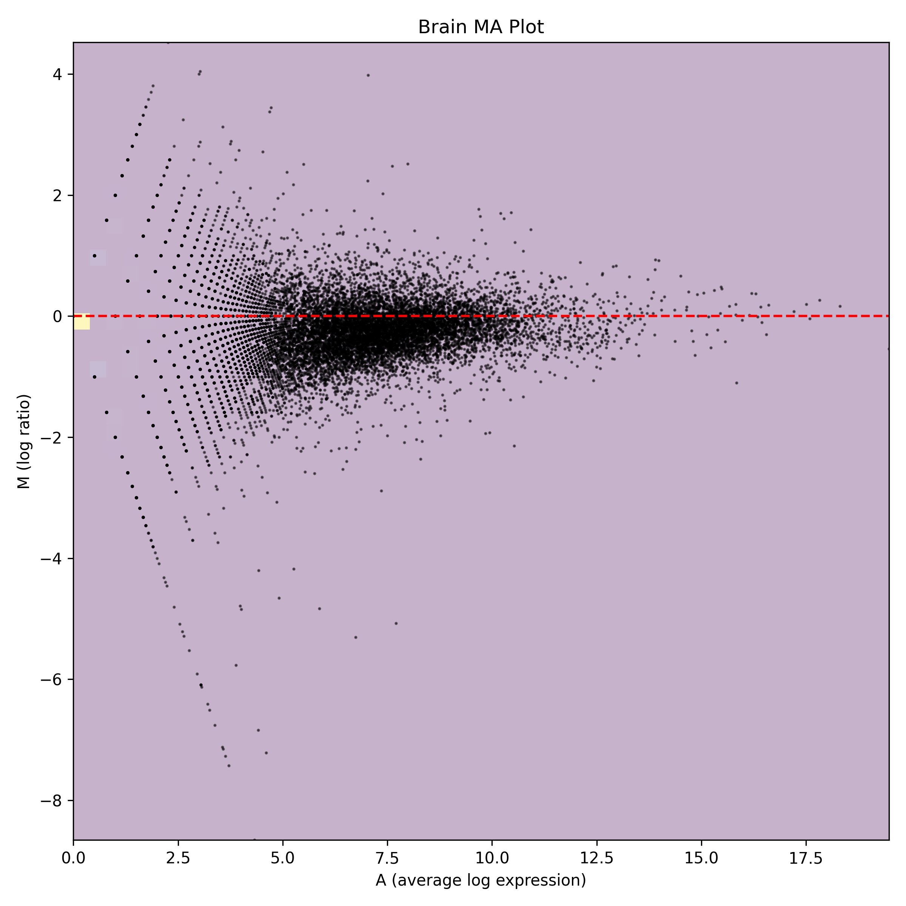
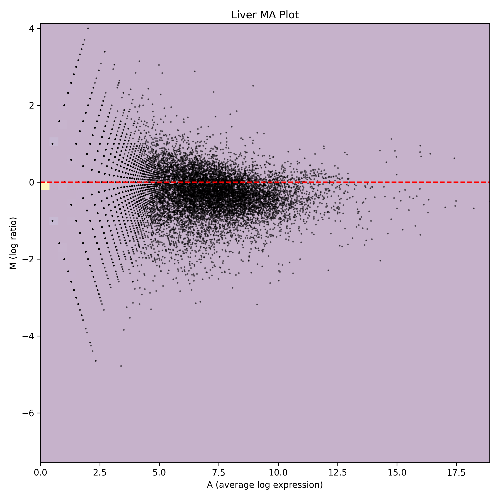
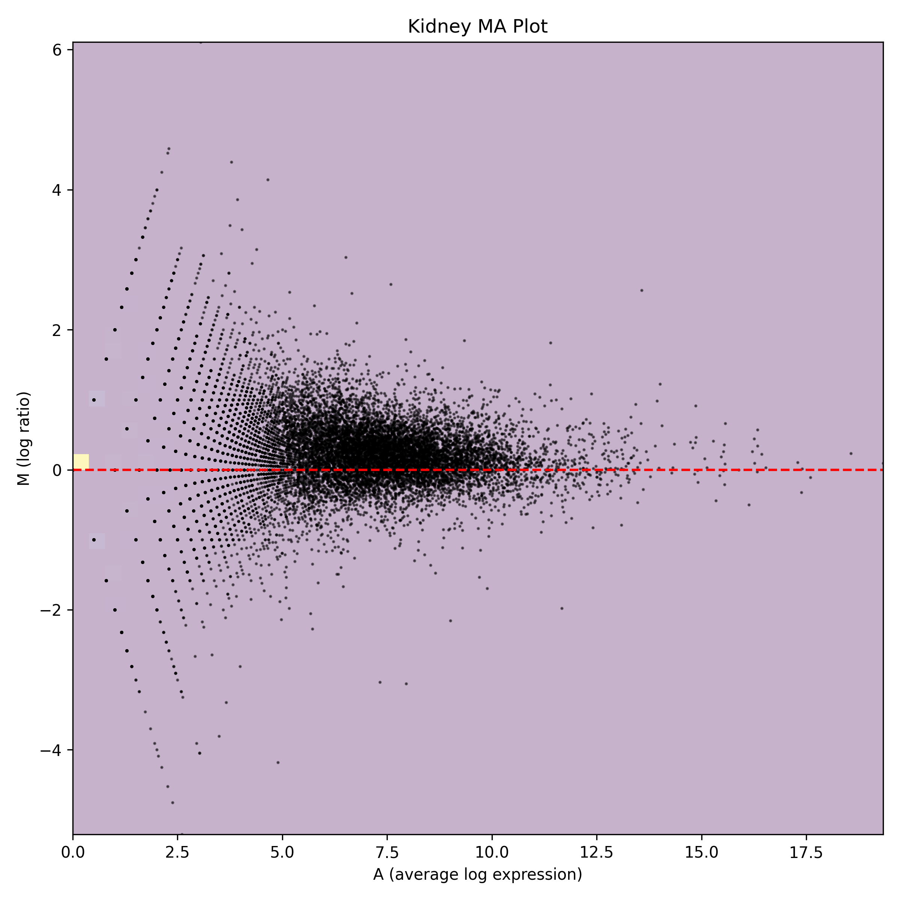
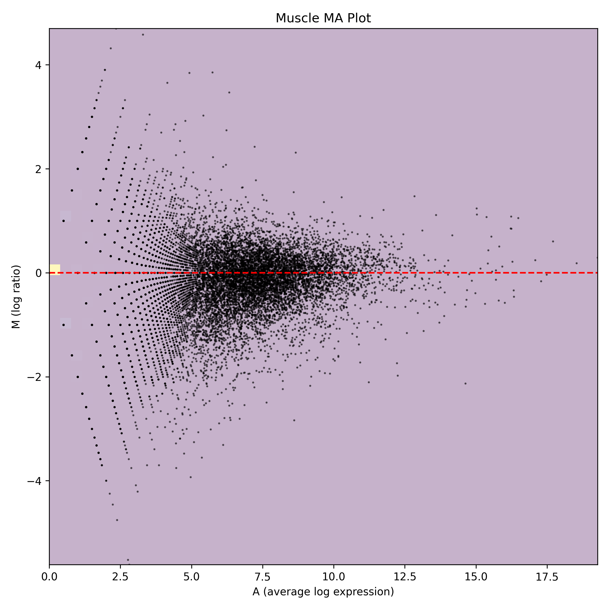
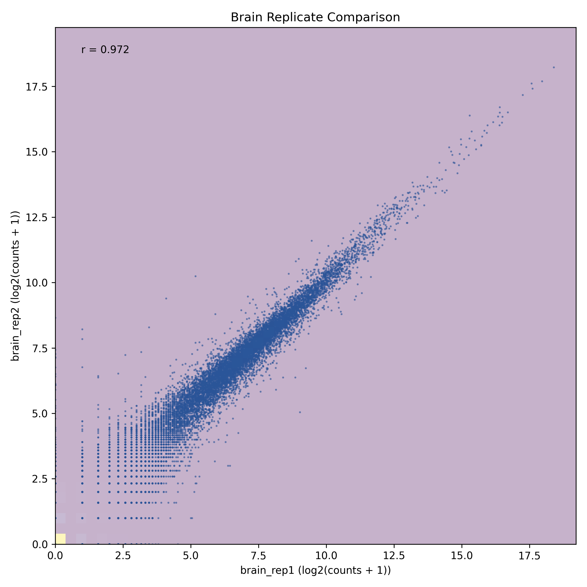
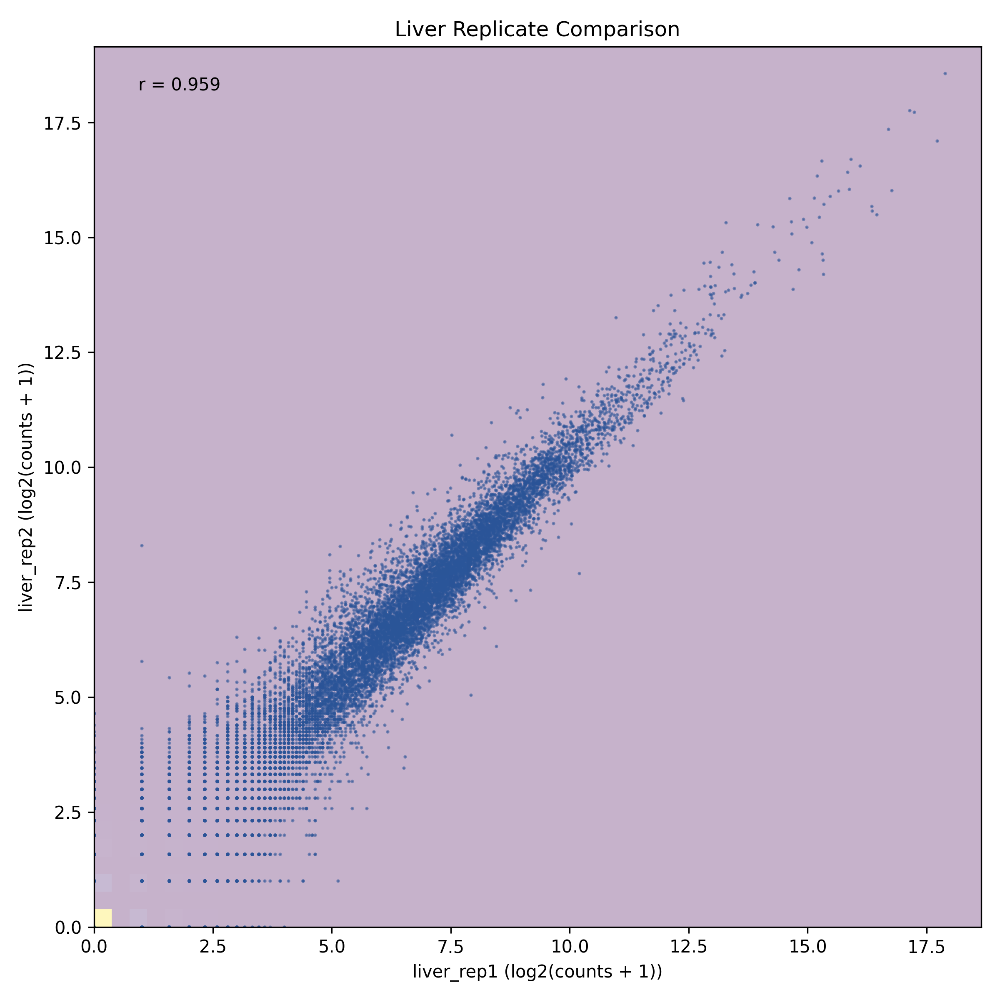
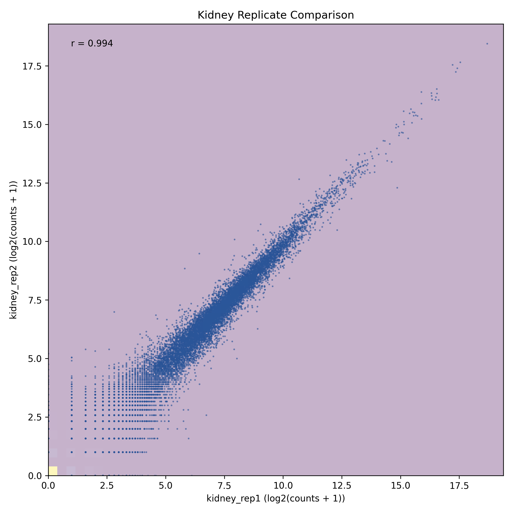
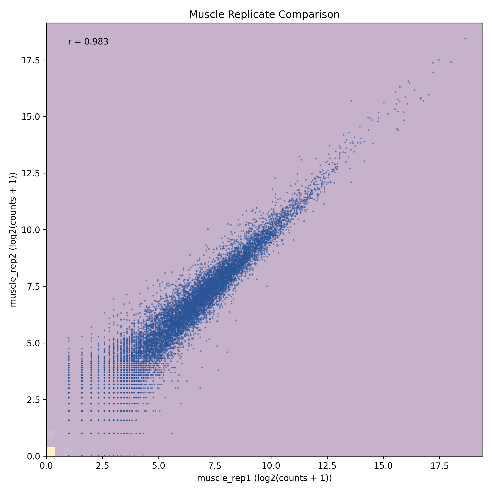

# Chicken Tissue RNA-seq Analysis

## Overview
This repository contains an RNA-seq analysis pipeline that reproduces and validates the tissue-specific gene expression patterns in chicken (Gallus gallus) using publicly available data. The analysis reproduces parts of the study published by Piórkowska, et al. (2016) in Animal Genetics, examining transcriptional profiles of brain, kidney, liver, and muscle tissues.

## Data Source
- **Original Study**: This analysis uses public data from Piórkowska K, et al. (2016). Genome-wide RNA-Seq analysis of breast muscles of two broiler chicken groups differing in shear force. Animal Genetics, 47(1):68-80.
- **Tissue Types**: Brain, kidney, liver, and muscle
- **Experimental Design**: Multiple replicates per tissue type
- **Data Processing**: RNA-seq analysis performed on IFB cluster
- **Note**: This is an independent reproduction study and is not affiliated with the original authors.

## Directory Structure
```
.
├── data/               # Raw sequencing data and metadata
├── genome/            # Reference genome and annotation files
├── scripts/           # Analysis and plotting scripts
├── results/           # Analysis output files
├── plots/             # Generated figures and visualizations
└── requirements.txt   # Python dependencies
```

## Analysis Pipeline
1. Quality Control and Preprocessing
   - Raw data QC
   - Adapter trimming
   - Quality filtering

2. Alignment and Quantification
   - Reference genome alignment
   - Expression quantification
   - Generation of expression matrix

3. Differential Expression Analysis
   - Tissue-specific expression patterns
   - Statistical analysis
   - Visualization

4. Visualization
   - Correlation plots
   - MA plots
   - PCA plots
   - Tissue-specific expression patterns

## Requirements
See requirements.txt for Python package dependencies. Main requirements include:
- Python 3.6+
- NumPy
- Pandas
- Matplotlib
- Seaborn
- DESeq2

## Usage
1. Clone the repository:
```bash
git clone https://github.com/username/chicken_atlas.git
cd chicken_atlas
```

2. Install dependencies:
```bash
pip install -r requirements.txt
```

3. Run the analysis pipeline:
```bash
python scripts/plot_expression_matrix.py
```

## Results
The analysis reveals tissue-specific expression patterns across brain, kidney, liver, and muscle samples. Key findings include:

### 1. Sample Correlation Analysis
The heatmap below shows the correlation between different tissue samples, highlighting tissue-specific clustering:


### 2. Principal Component Analysis
PCA analysis reveals clear separation between different tissue types:


### 3. Differential Expression Analysis
MA plots showing the distribution of differentially expressed genes in different tissues:

<details>
<summary>Click to expand MA plots</summary>

#### Brain


#### Liver


#### Kidney


#### Muscle

</details>

### 4. Technical Reproducibility
Scatter plots showing high correlation between biological replicates:

<details>
<summary>Click to expand replicate plots</summary>

#### Brain Replicates


#### Liver Replicates


#### Kidney Replicates


#### Muscle Replicates

</details>

Key findings from the analysis:
- Clear tissue-specific clustering in both PCA and correlation analysis
- High reproducibility between biological replicates (R² > 0.95)
- Distinct differential expression patterns in each tissue
- Identification of tissue-specific gene signatures

## Contributing
Please feel free to submit issues and pull requests.

## License
This project is licensed under the MIT License - see the LICENSE file for details.

## Citation
If you use this analysis pipeline, please cite both this repository and the original data source:

```
Original Data:
Piórkowska K, et al. (2016). Genome-wide RNA-Seq analysis of breast muscles of two broiler 
chicken groups differing in shear force. Animal Genetics, 47(1):68-80.

Analysis Pipeline:
Nguyen A (2024) - Chicken Tissue RNA-seq Analysis: A reproduction study
```

## Contact
For questions about this reproduction analysis, please open a GitHub issue or contact Alexis NGUYEN (alexisnguyen97@yahoo.fr) 