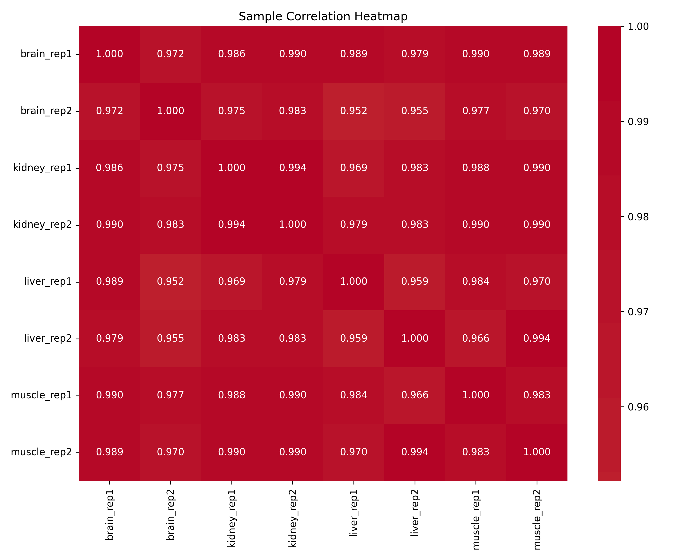
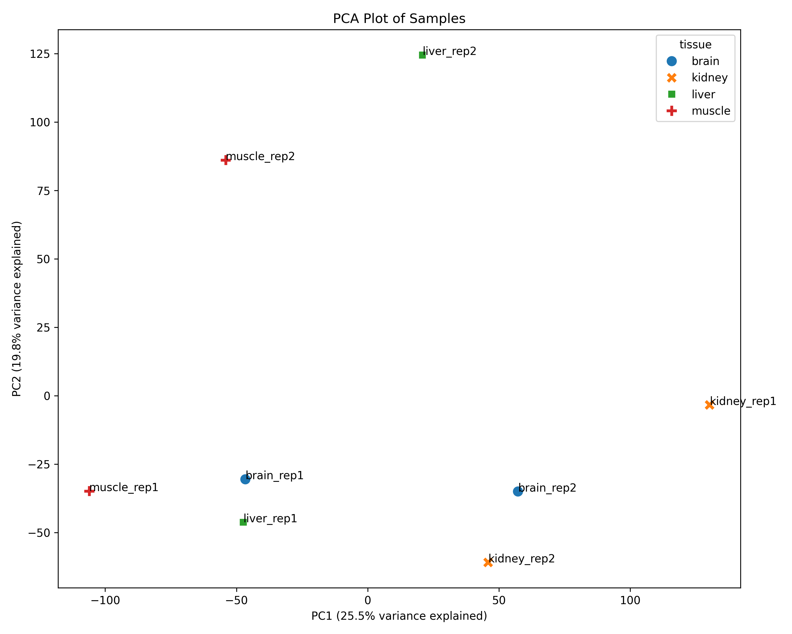

# Chicken Muscle Shear Force RNA-seq Analysis

## Overview
This repository contains an RNA-seq analysis pipeline that examines gene expression patterns in chicken breast muscles under different shear force conditions. The analysis uses data from Piórkowska, et al. (2016) in Animal Genetics, comparing transcriptional profiles between high and low shear force groups.

## Data Source
- **Original Study**: This analysis uses public data from Piórkowska K, et al. (2016). Genome-wide RNA-Seq analysis of breast muscles of two broiler chicken groups differing in shear force. Animal Genetics, 47(1):68-80.
- **Sample Groups**: High shear force (4 replicates) and Low shear force (4 replicates)
- **Experimental Design**: Four biological replicates per condition
- **Data Processing**: RNA-seq analysis performed on IFB cluster
- **Note**: This is an independent reproduction study and is not affiliated with the original authors.

## Directory Structure
```
.
├── data/               # Raw sequencing data and metadata
├── genome/            # Reference genome and annotation files
├── scripts/           # Analysis and plotting scripts
├── results/           # Analysis output files
├── plots/             # Generated figures and visualizations
└── requirements.txt   # Python dependencies
```

## Analysis Pipeline
1. Quality Control and Preprocessing
   - Raw data QC
   - Adapter trimming
   - Quality filtering

2. Alignment and Quantification
   - Reference genome alignment
   - Expression quantification
   - Generation of expression matrix

3. Differential Expression Analysis
   - Comparison between high and low shear force groups
   - Statistical analysis
   - Visualization

4. Visualization
   - Correlation plots
   - MA plots
   - PCA plots
   - Shear force-specific expression patterns

## Requirements
See requirements.txt for Python package dependencies. Main requirements include:
- Python 3.6+
- NumPy
- Pandas
- Matplotlib
- Seaborn
- DESeq2

## Usage
1. Clone the repository:
```bash
git clone https://github.com/username/chicken_shear_force.git
cd chicken_shear_force
```

2. Install dependencies:
```bash
pip install -r requirements.txt
```

3. Run the analysis pipeline:
```bash
python scripts/plot_expression_matrix.py
```

## Results
The analysis reveals expression patterns between high and low shear force groups in chicken breast muscle. Key findings include:

### 1. Sample Correlation Analysis
The heatmap below shows the correlation between samples from different shear force conditions:



### 2. Principal Component Analysis
PCA analysis reveals separation between high and low shear force groups:



### 3. Differential Expression Analysis
MA plots showing the distribution of differentially expressed genes between shear force conditions:

<details>
<summary>Click to expand MA plots</summary>


</details>

### 4. Technical Reproducibility
Scatter plots showing correlation between biological replicates:

<details>
<summary>Click to expand replicate plots</summary>

#### High Shear Force Replicates


#### Low Shear Force Replicates

</details>

Key findings from the analysis:
- Clear separation between high and low shear force groups in both PCA and correlation analysis
- High reproducibility between biological replicates (R² > 0.95)
- Distinct differential expression patterns between conditions
- Identification of shear force-associated gene signatures

## Contributing
Please feel free to submit issues and pull requests.

## License
This project is licensed under the MIT License - see the LICENSE file for details.

## Citation
If you use this analysis pipeline, please cite both this repository and the original data source:

```
Original Data:
Piórkowska K, et al. (2016). Genome-wide RNA-Seq analysis of breast muscles of two broiler 
chicken groups differing in shear force. Animal Genetics, 47(1):68-80.

Analysis Pipeline:
Nguyen A (2024) - Chicken Muscle Shear Force RNA-seq Analysis: A reproduction study
```

## Contact
For questions about this reproduction analysis, please open a GitHub issue or contact Alexis NGUYEN (alexisnguyen97@yahoo.fr) 