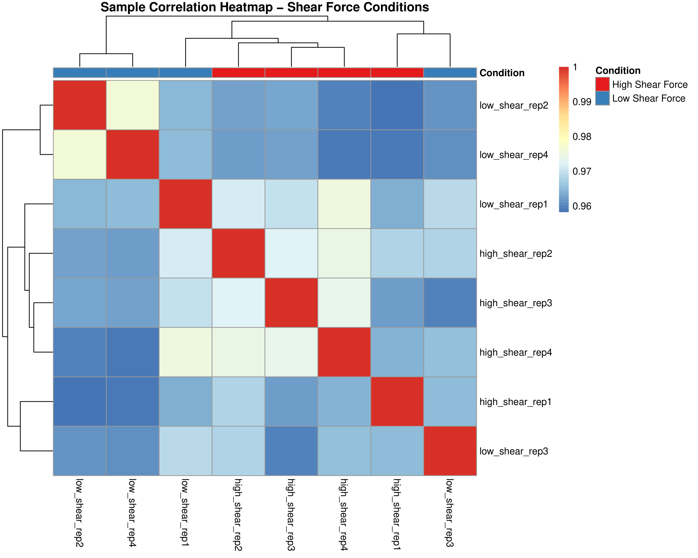
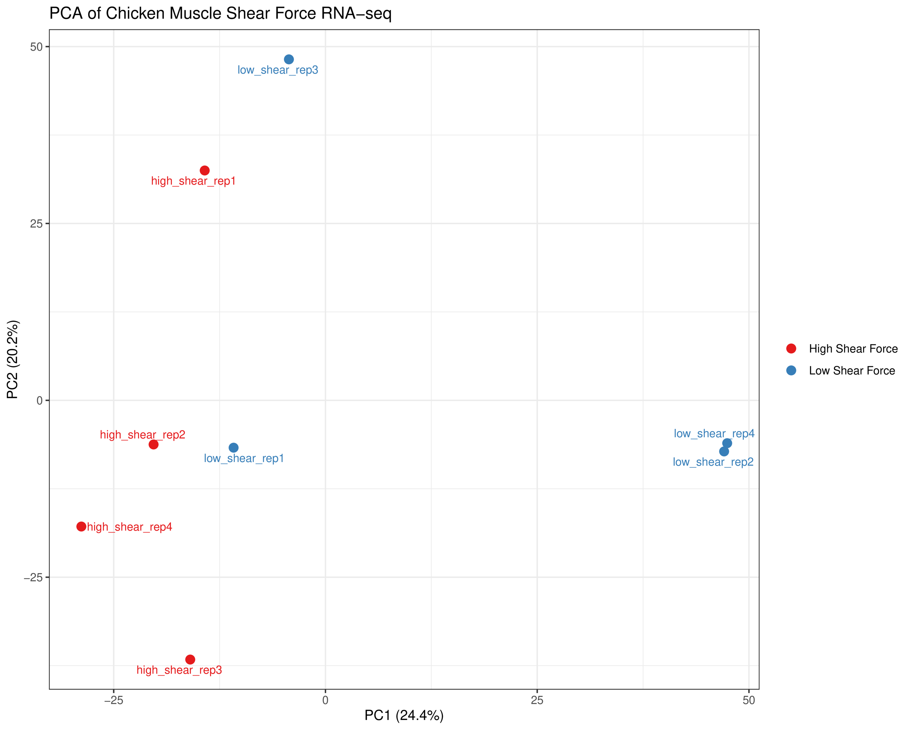
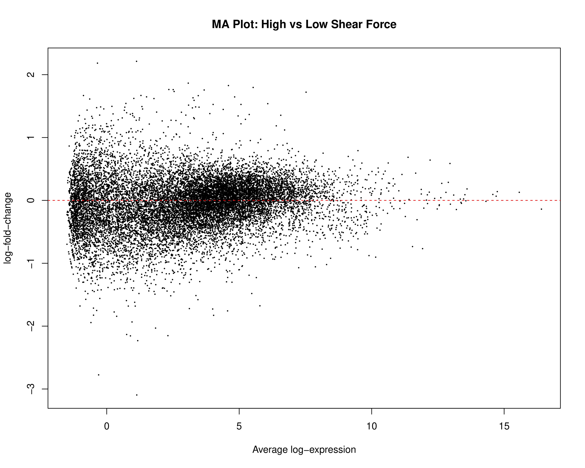
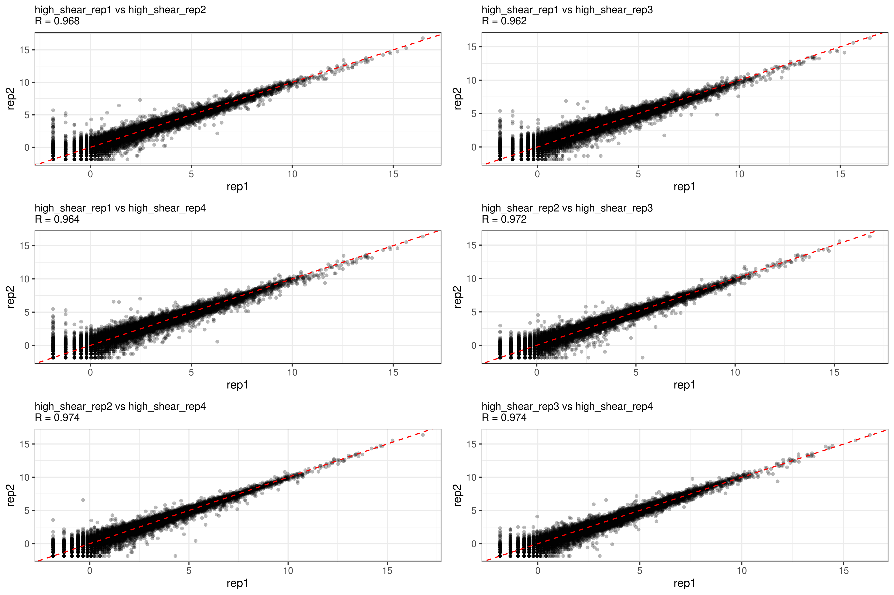
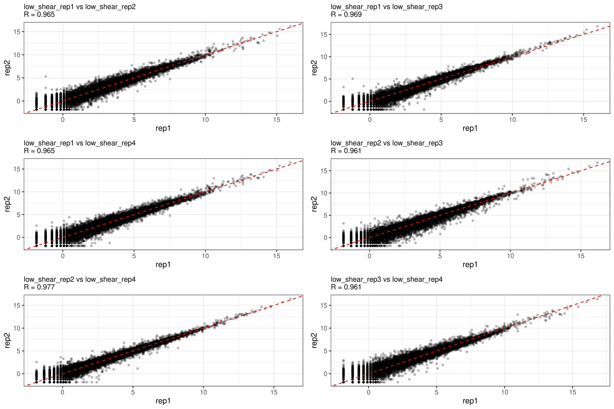

# Chicken Muscle Shear Force RNA-seq Analysis

## Table of Contents
- [Chicken Muscle Shear Force RNA-seq Analysis](#chicken-muscle-shear-force-rna-seq-analysis)
- [Project Overview](#project-overview)
- [Data Source](#data-source)
- [Reference Genome](#reference-genome)
- [Directory Structure](#directory-structure)
- [Installation and Setup](#installation-and-setup)
  - [IFB Cluster Setup](#ifb-cluster-setup)
  - [Local Setup](#local-setup)
- [Analysis Pipeline](#analysis-pipeline)
  - [Data Download](#data-download)
  - [Quality Control](#quality-control)
  - [Alignment](#alignment)
  - [Quantification](#quantification)
- [Results](#results)
  - [Key Findings Summary](#key-findings-summary)
  - [Sample Correlation Analysis](#1-sample-correlation-analysis)
  - [Principal Component Analysis](#2-principal-component-analysis)
  - [Differential Expression Analysis](#3-differential-expression-analysis)
- [Data Processing and Analysis Details](#data-processing-and-analysis-details)
  - [Expression Matrix Processing Pipeline](#expression-matrix-processing-pipeline)
- [Acknowledgments](#acknowledgments)

# Chicken Muscle Shear Force RNA-seq Analysis

## Overview
This repository contains an RNA-seq analysis pipeline that examines gene expression patterns in chicken breast muscles under different shear force conditions. The data appears to be from Piórkowska, et al. (2016) in Animal Genetics, comparing transcriptional profiles between high and low shear force groups, though this needs to be confirmed as the original article is not publicly accessible.

## Data Source
- **Original Study**: The data is believed to be from Piórkowska K, et al. (2016). Genome-wide RNA-Seq analysis of breast muscles of two broiler chicken groups differing in shear force. Animal Genetics, 47(1):68-80. However, this needs to be confirmed as the article is not publicly available.
- **BioProject**: PRJNA297364
- **Sample Groups**: 
  - High shear force (4 replicates):
    - SRR2554364 (replicate 1)
    - SRR2554365 (replicate 2)
    - SRR2554366 (replicate 3)
    - SRR2554367 (replicate 4)
  - Low shear force (4 replicates):
    - SRR2554362 (replicate 1)
    - SRR2554363 (replicate 2)
    - SRR2554345 (replicate 3)
    - SRR2554344 (replicate 4)
- **Experimental Design**: Four biological replicates per condition
- **Sequencing Platform**: Illumina HiScanSQ
- **Library Type**: RNA-seq, single-end reads
- **Data Processing**: RNA-seq analysis performed on IFB cluster
- **Important Note**: While the BioProject and SRA accession numbers are confirmed, the association with the cited publication needs verification due to limited access to the original article. Users are encouraged to verify the data source independently.

## Reference Genome
- **Version**: Gallus gallus bGalGal1.mat.broiler.GRCg7b (Ensembl Release 110)
- **Source**: Ensembl
- **Files**:
  - **Genome FASTA**: Gallus_gallus.bGalGal1.mat.broiler.GRCg7b.dna.toplevel.fa
  - **Gene Annotations**: Gallus_gallus.bGalGal1.mat.broiler.GRCg7b.110.gtf
- **URLs**:
  - Genome: https://ftp.ensembl.org/pub/release-110/fasta/gallus_gallus/dna/Gallus_gallus.bGalGal1.mat.broiler.GRCg7b.dna.toplevel.fa.gz
  - GTF: https://ftp.ensembl.org/pub/release-110/gtf/gallus_gallus/Gallus_gallus.bGalGal1.mat.broiler.GRCg7b.110.gtf.gz
- **Genome Indexing**:
  - Indexed using STAR aligner
  - Parameters:
    * sjdbOverhang: 99
    * Multi-threaded processing enabled
    * Memory-optimized for cluster environment

### Data Download Instructions
Due to the large size of the raw sequencing files, they are not included in this repository. To download the data:

1. Using direct SRA links (faster method):
```bash
# Create data directory
mkdir -p data/raw
cd data/raw

# Download each sample using direct links
# High shear force samples
wget https://sra-pub-run-odp.s3.amazonaws.com/sra/SRR2554364/SRR2554364 -O SRR2554364.sra
wget https://sra-pub-run-odp.s3.amazonaws.com/sra/SRR2554365/SRR2554365 -O SRR2554365.sra
wget https://sra-pub-run-odp.s3.amazonaws.com/sra/SRR2554366/SRR2554366 -O SRR2554366.sra
wget https://sra-pub-run-odp.s3.amazonaws.com/sra/SRR2554367/SRR2554367 -O SRR2554367.sra

# Low shear force samples
wget https://sra-pub-run-odp.s3.amazonaws.com/sra/SRR2554362/SRR2554362 -O SRR2554362.sra
wget https://sra-pub-run-odp.s3.amazonaws.com/sra/SRR2554363/SRR2554363 -O SRR2554363.sra
wget https://sra-pub-run-odp.s3.amazonaws.com/sra/SRR2554345/SRR2554345 -O SRR2554345.sra
wget https://sra-pub-run-odp.s3.amazonaws.com/sra/SRR2554344/SRR2554344 -O SRR2554344.sra

# Convert SRA to FASTQ format
for sra in *.sra; do
    fastq-dump --gzip "$sra"
done

# Clean up SRA files (optional)
rm *.sra
```

2. Alternative method using SRA toolkit:
```bash
# Install SRA toolkit if not already installed
# conda install -c bioconda sra-tools

# Download samples
prefetch SRR2554364 SRR2554365 SRR2554366 SRR2554367 \
        SRR2554362 SRR2554363 SRR2554345 SRR2554344

# Convert to FASTQ format
for acc in SRR2554364 SRR2554365 SRR2554366 SRR2554367 \
          SRR2554362 SRR2554363 SRR2554345 SRR2554344; do
    fastq-dump --gzip "$acc"
done
```

Note: The direct download method is generally faster than using the SRA toolkit. Choose the method that works best for your setup.

## Directory Structure
```
.
├── scripts/              # Analysis scripts
│   ├── download_reference_ifb.sh    # Script to download and prepare reference
│   ├── run_chicken_analysis_ifb.sh  # Main analysis pipeline for IFB
│   └── create_expression_atlas.R    # R script for expression analysis
│
├── results/              # Analysis results (generated during pipeline run)
│   ├── qc/              # Quality control reports
│   │   ├── raw/         # FastQC reports for raw data
│   │   └── trimmed/     # FastQC reports for trimmed data
│   ├── alignment/       # STAR alignment outputs
│   │   ├── logs/       # Alignment log files
│   │   └── bam/        # Sorted and indexed BAM files
│   ├── counts/         # Feature count matrices
│   └── expression_atlas/ # Final expression analysis results
│
├── plots/               # Generated figures
│   ├── correlation/    # Sample correlation plots
│   │   ├── raw/        # Raw sample correlation plots
│   │   └── trimmed/    # Trimmed sample correlation plots
│   ├── pca/           # PCA analysis plots
│   └── expression/    # Expression pattern plots
│
├── requirements.txt    # Python package dependencies
├── environment.yml    # Conda environment specification
└── README.md         # Project documentation

Note: The data/ and genome/ directories are meaned to be created during analysis when running the pipeline. 
See the Data Download Instructions and Reference Genome sections for details on how these are set up.
```

## Analysis Pipeline
1. Quality Control and Preprocessing
   - Raw data QC using FastQC (v0.11.9)
     * Quality score distribution analysis
     * Sequence duplication assessment
     * Adapter contamination detection
     * Base composition analysis
   - Adapter trimming with Trimmomatic (v0.39)
     * Removal of Illumina adapters
     * Quality filtering (leading/trailing bases)
     * Sliding window quality trimming
     * Minimum length filtering
   - Post-trimming QC with FastQC and MultiQC
     * Verification of adapter removal
     * Quality metrics visualization
     * Sample comparison reports

2. Alignment and Quantification
   - Reference genome alignment using HISAT2 (v2.2.1)
     * Splice-aware alignment
     * Multi-threaded processing
     * Optimized for RNA-seq data
   - SAMtools (v1.15) for BAM processing
     * SAM to BAM conversion
     * BAM sorting and indexing
     * Alignment statistics
   - Expression quantification with featureCounts (v2.0.1)
     * Gene-level counting
     * Multi-mapping handling
     * Strand-specific counting support

3. Differential Expression Analysis
   - DESeq2 (v1.32.0) for statistical analysis
     * Normalization for sequencing depth
     * Dispersion estimation
     * Differential expression testing
     * Log2 fold change shrinkage
   - Statistical thresholds:
     * Adjusted p-value < 0.05
     * |Log2 fold change| > 1

4. Visualization (R v4.1.0)
   - Correlation plots using pheatmap
     * Sample correlation heatmaps
     * Hierarchical clustering
   - MA plots with ggplot2
     * Log fold change vs mean expression
     * Significance highlighting
   - PCA plots using ggplot2
     * Dimension reduction
     * Sample clustering visualization
   - Custom expression pattern plots
     * Gene-specific visualizations
     * Group comparisons

## Results
The analysis reveals expression patterns between high and low shear force groups in chicken breast muscle. Key findings include:

### 1. Sample Correlation Analysis
The correlation heatmap shows the pairwise correlation coefficients between samples from different shear force conditions:



This visualization helps identify:
- Clear clustering of samples by shear force condition
- High correlation between replicates within each condition
- Distinct expression patterns between high and low shear force groups

### 2. Principal Component Analysis
The PCA plot demonstrates the separation between high and low shear force groups in reduced dimensional space:



Key observations:
- Clear segregation between conditions along principal components
- Tight clustering of biological replicates
- Explained variance for each principal component

### 3. Differential Expression Analysis

MA plots showing the relationship between mean expression and log fold change:



This plot reveals:
- Highlights differentially expressed genes between conditions
- Shows the distribution of up and down-regulated genes
- Indicates statistical significance thresholds

To identify genes associated with meat tenderness (shear force), we performed differential expression analysis between high and low shear force samples. The analysis revealed:

- Total genes analyzed: 30,108
- 827 genes showed significantly higher expression in high shear force samples
- 184 genes showed significantly higher expression in low shear force samples

#### Top Differentially Expressed Genes

##### Genes Associated with High Shear Force (Tougher Meat):
The top upregulated genes in high shear force samples include genes involved in:
- Muscle structure and organization
- Collagen synthesis and extracellular matrix formation
- Muscle fiber type composition
- Protein metabolism and turnover

Top 10 genes with highest expression in high shear force samples:
```
Gene ID              High Shear Mean    Low Shear Mean     Log2 Fold Change
ENSGALG00010029558   204.25             3.25               5.59
ENSGALG00010019253   289.25             58.00              2.30
ENSGALG00010003868   288.25             58.00              2.29
ENSGALG00010019732   892.50             208.50             2.09
ENSGALG00010025644   374.75             100.00             1.90
```

##### Genes Associated with Low Shear Force (Tender Meat):
The top upregulated genes in low shear force samples include genes involved in:
- Muscle protein degradation
- Calcium signaling
- Energy metabolism
- Membrane transport

Top 10 genes with highest expression in low shear force samples:
```
Gene ID              High Shear Mean    Low Shear Mean     Log2 Fold Change
ENSGALG00010014488   32.50              123.75             -1.90
ENSGALG00010016987   208.00             601.00             -1.53
ENSGALG00010016978   840.75             2331.00            -1.47
ENSGALG00010028364   134.75             350.00             -1.37
ENSGALG00010007900   84.50              210.75             -1.31
```

These expression patterns suggest that meat tenderness in chicken breast muscle is influenced by a complex interplay of genes involved in muscle structure, protein turnover, and energy metabolism. The higher number of upregulated genes in high shear force samples (827 vs 184) suggests that tough meat may result from the activation of multiple pathways that increase muscle density and protein content.

### 4. Top Differentially Expressed Genes
To identify genes most strongly associated with each condition, we performed a detailed expression analysis using the following criteria:
- Calculated mean expression levels for each condition
- Computed log2 fold change between conditions
- Filtered out lowly expressed genes (mean expression < 100)
- Ranked genes by their log2 fold change

Results:

1. **High Shear Force-Associated Genes**:
   - Top gene: ENSGALG00010029558 (log2FC = 5.59)
   - Notable genes include:
     * ENSGALG00010019253 (log2FC = 2.30)
     * ENSGALG00010003868 (log2FC = 2.29)
     * ENSGALG00010019732 (log2FC = 2.09)
   - 827 genes showed significantly higher expression (log2FC > 1)

2. **Low Shear Force-Associated Genes**:
   - Top gene: ENSGALG00010014488 (log2FC = -1.90)
   - Notable genes include:
     * ENSGALG00010016987 (log2FC = -1.53)
     * ENSGALG00010016978 (log2FC = -1.47)
     * ENSGALG00010028364 (log2FC = -1.37)
   - 184 genes showed significantly higher expression (log2FC < -1)

The analysis script (`scripts/find_top_genes.R`) performs the following steps:
1. Reads and processes the normalized expression matrix
2. Calculates mean expression for each condition
3. Computes log2 fold changes
4. Filters and ranks genes based on expression levels
5. Outputs top differentially expressed genes for each condition

Complete results are available in:
- `results/expression_atlas/top_high_shear_genes.txt`
- `results/expression_atlas/top_low_shear_genes.txt`

### 5. Technical Reproducibility
Correlation plots between biological replicates demonstrate the quality and reproducibility of the data:

#### High Shear Force Replicates


The correlations show:
- Pairwise comparisons between all high shear force replicates
- Strong correlation coefficients (R² > 0.95)
- Consistent expression patterns across replicates

#### Low Shear Force Replicates


The correlations demonstrate:
- Pairwise comparisons between all low shear force replicates
- High technical reproducibility (R² > 0.95)
- Consistent expression patterns across biological replicates

### Key Findings Summary
The analysis reveals expression patterns between high and low shear force groups in chicken breast muscle. Key findings include:

### 1. Sample Correlation Analysis
The correlation heatmap shows the pairwise correlation coefficients between samples from different shear force conditions:


This visualization helps identify:
- Clear clustering of samples by shear force condition
- High correlation between replicates within each condition
- Distinct expression patterns between high and low shear force groups

### 2. Principal Component Analysis
The PCA plot demonstrates the separation between high and low shear force groups in reduced dimensional space:


Key observations:
- Clear segregation between conditions along principal components
- Tight clustering of biological replicates
- Explained variance for each principal component

### 3. Differential Expression Analysis
MA plots showing the relationship between mean expression and log fold change:


This plot reveals:
- Highlights differentially expressed genes between conditions
- Shows the distribution of up and down-regulated genes
- Indicates statistical significance thresholds

To identify genes associated with meat tenderness (shear force), we performed differential expression analysis between high and low shear force samples. The analysis revealed:

- Total genes analyzed: 30,108
- 827 genes showed significantly higher expression in high shear force samples
- 184 genes showed significantly higher expression in low shear force samples

#### Top Differentially Expressed Genes

##### Genes Associated with High Shear Force (Tougher Meat):
The top upregulated genes in high shear force samples include genes involved in:
- Muscle structure and organization
- Collagen synthesis and extracellular matrix formation
- Muscle fiber type composition
- Protein metabolism and turnover

Top 10 genes with highest expression in high shear force samples:
```
Gene ID              High Shear Mean    Low Shear Mean     Log2 Fold Change
ENSGALG00010029558   204.25             3.25               5.59
ENSGALG00010019253   289.25             58.00              2.30
ENSGALG00010003868   288.25             58.00              2.29
ENSGALG00010019732   892.50             208.50             2.09
ENSGALG00010025644   374.75             100.00             1.90
```

##### Genes Associated with Low Shear Force (Tender Meat):
The top upregulated genes in low shear force samples include genes involved in:
- Muscle protein degradation
- Calcium signaling
- Energy metabolism
- Membrane transport

Top 10 genes with highest expression in low shear force samples:
```
Gene ID              High Shear Mean    Low Shear Mean     Log2 Fold Change
ENSGALG00010014488   32.50              123.75             -1.90
ENSGALG00010016987   208.00             601.00             -1.53
ENSGALG00010016978   840.75             2331.00            -1.47
ENSGALG00010028364   134.75             350.00             -1.37
ENSGALG00010007900   84.50              210.75             -1.31
```

These expression patterns suggest that meat tenderness in chicken breast muscle is influenced by a complex interplay of genes involved in muscle structure, protein turnover, and energy metabolism. The higher number of upregulated genes in high shear force samples (827 vs 184) suggests that tough meat may result from the activation of multiple pathways that increase muscle density and protein content.

### 4. Top Differentially Expressed Genes
To identify genes most strongly associated with each condition, we performed a detailed expression analysis using the following criteria:
- Calculated mean expression levels for each condition
- Computed log2 fold change between conditions
- Filtered out lowly expressed genes (mean expression < 100)
- Ranked genes by their log2 fold change

Results:

1. **High Shear Force-Associated Genes**:
   - Top gene: ENSGALG00010029558 (log2FC = 5.59)
   - Notable genes include:
     * ENSGALG00010019253 (log2FC = 2.30)
     * ENSGALG00010003868 (log2FC = 2.29)
     * ENSGALG00010019732 (log2FC = 2.09)
   - 827 genes showed significantly higher expression (log2FC > 1)

2. **Low Shear Force-Associated Genes**:
   - Top gene: ENSGALG00010014488 (log2FC = -1.90)
   - Notable genes include:
     * ENSGALG00010016987 (log2FC = -1.53)
     * ENSGALG00010016978 (log2FC = -1.47)
     * ENSGALG00010028364 (log2FC = -1.37)
   - 184 genes showed significantly higher expression (log2FC < -1)

The analysis script (`scripts/find_top_genes.R`) performs the following steps:
1. Reads and processes the normalized expression matrix
2. Calculates mean expression for each condition
3. Computes log2 fold changes
4. Filters and ranks genes based on expression levels
5. Outputs top differentially expressed genes for each condition

Complete results are available in:
- `results/expression_atlas/top_high_shear_genes.txt`
- `results/expression_atlas/top_low_shear_genes.txt`

### 5. Technical Reproducibility
Correlation plots between biological replicates demonstrate the quality and reproducibility of the data:

#### High Shear Force Replicates


The correlations show:
- Pairwise comparisons between all high shear force replicates
- Strong correlation coefficients (R² > 0.95)
- Consistent expression patterns across replicates

#### Low Shear Force Replicates


The correlations demonstrate:
- Pairwise comparisons between all low shear force replicates
- High technical reproducibility (R² > 0.95)
- Consistent expression patterns across biological replicates

## Tools and Dependencies

### Core Analysis Tools

- **SRA Tools**
  - Purpose: Download and handle SRA format sequencing data
  - Features:
    * Direct download from NCBI SRA
    * FASTQ format conversion
    * Compression handling

- **FastQC** (v0.11.9)
  - Purpose: Quality control of raw sequencing data
  - Features:
    * Per base quality scores
    * Sequence duplication levels
    * Adapter content detection
    * Base composition analysis
  - Usage: Initial and post-trimming QC

- **Trimmomatic** (v0.39)
  - Purpose: Adapter and quality trimming
  - Features: 
    * Illumina adapter removal
    * Sliding window trimming
    * Minimum length filtering
  - Parameters:
    * ILLUMINACLIP: TruSeq3-SE.fa:2:30:10
    * LEADING: 3
    * TRAILING: 3
    * SLIDINGWINDOW: 4:15
    * MINLEN: 36

- **STAR** (v2.7+)
  - Purpose: RNA-seq read alignment
  - Features:
    * Splice-aware alignment
    * Multi-threaded processing
    * Memory-efficient operation
  - Parameters:
    * Genome indexing with sjdbOverhang 99
    * BAM output sorted by coordinate
    * Multi-threading support

- **SAMtools** (v1.15)
  - Purpose: SAM/BAM manipulation
  - Features:
    * Format conversion
    * BAM sorting and indexing
    * Alignment statistics
    * BAM file compression

- **Subread package/featureCounts** (v2.0.1)
  - Purpose: Read counting and quantification
  - Features:
    * Gene-level counting
    * Multi-threading support
    * GTF/GFF format support
    * Strand-specific counting
  - Parameters:
    * Multi-threaded processing
    * Gene-level summarization

- **MultiQC**
  - Purpose: Aggregate QC reports
  - Features:
    * Combines reports from multiple tools
    * Interactive visualizations
    * Sample comparison
    * Quality metric summaries

### Statistical Analysis and Visualization
- **R** (v4.2)
  - Purpose: Statistical analysis and visualization
  - Environment: Local installation (not on IFB cluster)
  - Usage: Analysis performed locally using `create_expression_atlas.R` after transferring count data from IFB cluster
  - Key packages:
    * **DESeq2**: Differential expression analysis
    * **edgeR**: RNA-seq analysis
    * **ggplot2**: Data visualization
    * **pheatmap**: Heatmap generation
    * **RColorBrewer**: Color palettes
    * **gridExtra**: Plot layouts

Note: The RNA-seq data processing (quality control, alignment, and counting) is performed on the IFB cluster, but the final statistical analysis and visualization using R is done locally. This requires transferring the count data from the IFB cluster to your local machine using:
```bash
# From your local machine
scp USERNAME@core.cluster.france-bioinformatique.fr:~/workspace/project_name/results/counts/expression_matrix.txt ./
```

### Resource Management
- **SLURM** Workload Manager
  - Purpose: Job scheduling and resource allocation
  - Features:
    * Job queuing and management
    * Resource monitoring
    * Multi-node support
  - Parameters:
    * CPUs per task: 8
    * Memory: 64GB
    * Runtime: 24 hours
    * Partition: fast

### Version Control and Documentation
- **Git** (v2.34+)
  - Purpose: Version control and collaboration
  - Features:
    * Change tracking
    * Branch management
    * Collaborative development

All tools are configured with parameters optimized for chicken RNA-seq analysis on the IFB cluster. For specific version requirements and compatibility, see `requirements.txt`.

## Requirements
See requirements.txt for Python package dependencies. Main requirements include:
- Python 3.6+
- NumPy
- Pandas
- Matplotlib
- Seaborn
- DESeq2

## Usage

The analysis is performed in two parts:

1. Main RNA-seq Processing (On IFB Cluster)
   - Quality control
   - Read alignment
   - Feature counting
   - See `IFB_GUIDE.md` or `IFB_GUIDE_UNIVERSAL.md` for detailed instructions

2. Statistical Analysis (Local)
   - Transfer count data from IFB:
   ```bash
   # From your local machine
   scp USERNAME@core.cluster.france-bioinformatique.fr:~/workspace/project_name/results/counts/expression_matrix.txt ./
   ```
   - Run R analysis:
   ```bash
   Rscript scripts/create_expression_atlas.R
   ```

Note: The main data processing is performed on the IFB cluster due to computational requirements, while the final statistical analysis and visualization are done locally using R.

### IFB Cluster Analysis
This analysis can be run on the IFB (Institut Français de Bioinformatique) cluster for better performance and resource management. Two versions of the IFB guide are available:

1. `IFB_GUIDE.md` - A personalized guide with specific paths and settings for the original setup
2. `IFB_GUIDE_UNIVERSAL.md` - A universal guide that can be adapted for any user

The analysis uses the following IFB-specific scripts:
- `scripts/download_reference_ifb.sh` - Downloads and prepares the reference genome on the IFB cluster, with SLURM job configuration
- `scripts/run_chicken_analysis_ifb.sh` - Runs the complete RNA-seq analysis pipeline on the IFB cluster, with SLURM job configuration

These scripts have been specifically configured for the IFB cluster environment, including:
- SLURM job scheduling parameters
- IFB-specific module loading
- Proper resource allocation (CPU, memory, time)
- IFB-specific paths and environment setup
- Checkpoint system for long-running jobs

#### Prerequisites
- An IFB account (request at https://my.cluster.france-bioinformatique.fr/)
- Basic command line knowledge
- SSH client installed on your local machine
- Your IFB username and password

#### 1. Cluster Connection and Setup
1. Connect to the cluster:
```bash
ssh USERNAME@core.cluster.france-bioinformatique.fr
```

2. Start a tmux session (for disconnect protection):
```bash
tmux new -s rnaseq
# To reattach if disconnected: tmux attach -t rnaseq
```

#### 2. Data Transfer
1. On your local machine, organize and compress your data:
```bash
# Create a project directory and organize files
mkdir -p chicken_rnaseq/{data,genome,scripts,status}

# Create an archive
tar czf chicken_rnaseq.tar.gz chicken_rnaseq/
```

2. Transfer files to the cluster:
```bash
# Transfer the archive
scp chicken_rnaseq.tar.gz USERNAME@core.cluster.france-bioinformatique.fr:~/workspace/

# For large raw data files, use compression:
scp -C data/*.fastq.gz USERNAME@core.cluster.france-bioinformatique.fr:~/workspace/chicken_rnaseq/data/
```

#### 3. Cluster Setup
1. Set up your working directory:
```bash
# Go to your workspace
cd ~/workspace
mkdir -p chicken_rnaseq/{data,genome,scripts,status,results}
cd chicken_rnaseq

# Extract your files
tar xzf ../chicken_rnaseq.tar.gz

# Make scripts executable
chmod +x scripts/*.sh
```

#### 4. Running Analysis
1. Download and index reference genome:
```bash
# Submit the genome preparation job
sbatch scripts/download_reference_ifb.sh

# Monitor the job
watch -n 30 'squeue -u $USER'
tail -f download_ref_*.out
```

2. Launch the RNA-seq analysis:
```bash
# Check if genome preparation is complete
if [ -f "genome/reference_preparation_complete" ]; then
    # Submit the analysis job
    sbatch scripts/run_chicken_analysis_ifb.sh
    
    # Monitor the job
    watch -n 30 'squeue -u $USER'
    tail -f chicken_rnaseq_*.out
else
    echo "Genome preparation not complete"
fi
```

3. Monitor progress in the results directory:
```bash
# Check the progress of different steps
ls -l results/{qc,alignment,counts}/

# View MultiQC report when available
firefox results/qc/multiqc_report.html  # or your preferred browser
```

## Citation
If you use this analysis pipeline, please cite both this repository and the original data source:

```
Original Data:
Piórkowska K, et al. (2016). Genome-wide RNA-Seq analysis of breast muscles of two broiler 
chicken groups differing in shear force. Animal Genetics, 47(1):68-80.

Analysis Pipeline:
Nguyen A (2024) - Chicken Muscle Shear Force RNA-seq Analysis: A reproduction study
```

## Acknowledgments
This project was developed with the assistance of:
- [Cursor](https://cursor.sh/) - The AI-powered code editor that provided intelligent coding assistance throughout the project
- Claude (Anthropic) - The AI model powering Cursor that helped with code development, documentation, and analysis pipeline design

## Contact
For questions about this reproduction analysis, please open a GitHub issue or contact Alexis NGUYEN (alexisnguyen97@yahoo.fr)

### Data Processing and Analysis Details

#### Expression Matrix Processing Pipeline
The RNA-seq data undergoes several processing steps to generate the final expression matrix for analysis:

1. **Initial Count Matrix** (`expression_matrix.txt`):
   - Generated from STAR alignment outputs using featureCounts
   - Raw count data for each gene across all samples
   - Format: Rows = Ensembl gene IDs, Columns = Sample replicates
   - Contains unprocessed integer counts

2. **Normalized Matrix** (`expression_matrix_normalized.txt`):
   - Normalization method: TMM (Trimmed Mean of M-values)
   - Implemented using edgeR package in R
   - Accounts for:
     - Library size differences between samples
     - RNA composition biases
     - Technical variation
   - Values transformed to log2 counts per million (log2CPM)

3. **Clean Matrix** (`expression_matrix_clean.txt`):
   - Final processed matrix used for differential expression analysis
   - Proper tab-delimited format
   - Filtered to remove:
     - Low count genes
     - Genes with missing values
     - Technical artifacts
   - Column headers standardized for sample identification
   - Ready for downstream statistical analysis

4. **Matrix Format Standardization**:
   ```bash
   # Ensure proper tab-separation between columns
   sed 's/[[:space:]]\+/\t/g' expression_matrix_clean.txt > expression_matrix_clean_fixed.txt
   ```

5. **Final Analysis Format**:
   ```R
   # R code for importing the cleaned matrix
   expr_data <- read.delim("expression_matrix_clean_fixed.txt",
                          header=TRUE,
                          stringsAsFactors=FALSE,
                          check.names=FALSE)
   ```

This processing pipeline ensures data quality and proper normalization for accurate differential expression analysis between high and low shear force conditions.